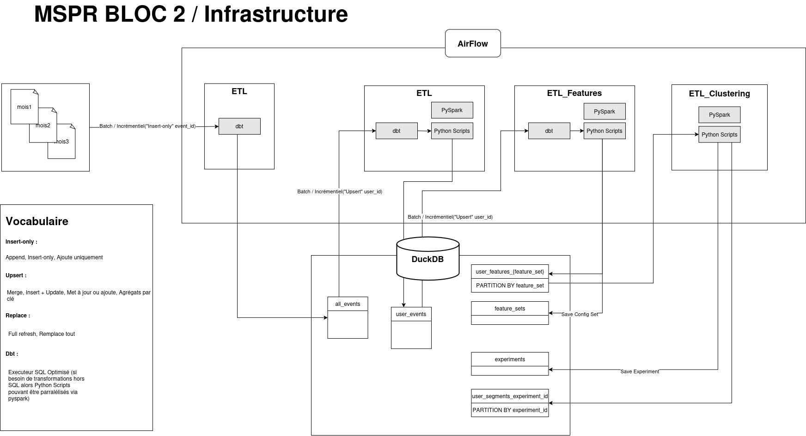

# 🦆 DuckDB ETL - Analyse Comportementale Utilisateur (Projet Amazing)

Ce projet est un pipeline de traitement de logs utilisateurs pour le marketplace **Amazing**, permettant de transformer des fichiers `.csv` en **features utilisateurs** exploitables pour du clustering ou de la segmentation comportementale.

---

## 🧱 Architecture du projet





### 📁 Données d'entrée
Des fichiers CSV contenant les événements utilisateur :

- Colonnes all_events : `event_time`, `event_type`, `product_id`, `category_code`, `price`, `user_id`, `user_session`
- Colonnes user_segments : `user_id`, `total_events`, `total_views`, `total_purchases`, `avg_time_between_events`, `total_spent`, `avg_basket`, `last_event_time`, `conversion_rate`, `purchase_ratio`, `days_since_last_event`, `segment`

### 🗃️ Base DuckDB locale
- Fichier généré : `amazing.duckdb`
- Tables principales :
  - `all_events` : tous les logs concaténés
  - `loaded_files` : suivi des fichiers déjà importés
  - `user_segments` : résultats du clustering utilisateur

---

## ⚙️ Fonctionnalités

- ✅ Chargement automatique des fichiers `.csv` depuis le dossier `./data`
- ✅ Ingestion dans DuckDB avec vérification anti-doublons
- ✅ Agrégation des événements utilisateur :
  - Nombre d'événements, vues, achats
  - Total dépensé, panier moyen, taux de conversion
  - Récence, délai moyen entre interactions
- ✅ Filtrage des utilisateurs avec **≥ 10 événements**
- ✅ Traitement par batch pour efficacité mémoire
- ✅ Clustering des utilisateurs (`KMeans`)
- ✅ Réduction de dimension (`PCA`) + Visualisation 2D
- ✅ Export des résultats dans la table `user_segments`

---

## 📊 Exemple de `user_features`

| user_id | segment | total_events | avg_basket | conversion_rate | days_since_last_event |
|---------|---------|---------------|-------------|------------------|------------------------|
| 123456  | 0       | 25            | 55.30       | 0.08             | 2                      |
| 987654  | 1       | 12            | 0.00        | 0.00             | 14                     |
| 333111  | 2       | 48            | 102.90      | 0.20             | 5                      |

---

## 🚀 Utilisation

### 1. Créer le dossier `data/` (s’il n’existe pas déjà)

```bash
mkdir data
```

Place dans ce dossier les fichiers `.csv` à importer (`2019-Oct.csv`, etc.)

### 2. Lancer le script

> 🕒 **Note importante** :  
> Le **premier chargement peut être très long** (plusieurs dizaines de minutes) si les fichiers contiennent des millions de lignes.  
> Ensuite, le script détecte automatiquement les fichiers déjà importés grâce à la table `loaded_files`.

### 3. Lancer le script de clustering

Cela calcule les statistiques utilisateur, filtre les profils actifs, applique KMeans et exporte les résultats dans user_segments.
Une visualisation des clusters est générée automatiquement.

---

## 🔎 Requêtes utiles

### Utilisateurs par segment

```sql
SELECT segment, COUNT(*) FROM user_segments GROUP BY segment;
```

### Utilisateurs récents

```sql
SELECT * FROM user_segments WHERE days_since_last_event < 7;
```


---

## 👤 Auteurs

Projet MSPR Bloc 2 – Étudiants ECDPIA  
Powered by 🦆 DuckDB, 💡 Pandas, 🤖 Scikit-learn
